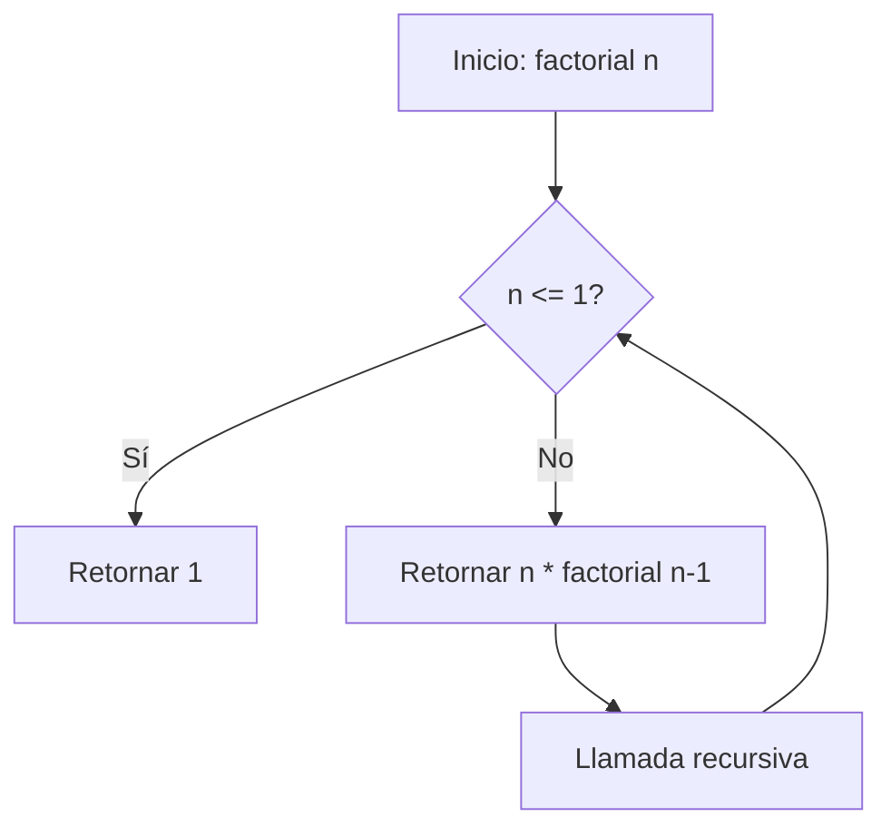

# Explicar Código con OpenSyn

Este capítulo cubre cómo usar OpenSyn para obtener explicaciones detalladas de código existente. Aprenderás a pedir explicaciones a diferentes niveles de detalle y en diferentes formatos.

Explicar código es esencial para entender sistemas complejos y onboarding de nuevos desarrolladores.

<!-- cumple Manual 7 §2.3 -->

## 1. Niveles de Explicación

### Breve (Resumen)

```bash
opensyn explain --detail low archivo.syq
```

> Función que calcula el factorial usando recursión.

### Detallado (Explicación paso a paso)

```bash
opensyn explain --detail high archivo.syq
```

> Esta función `factorial` calcula el factorial de un número entero `n`:
> 1. Caso base: si `n <= 1`, retorna 1 (por definición matemática)
> 2. Caso recursivo: retorna `n * factorial(n - 1)`, descomponiendo el problema en subproblemas cada vez más pequeños.

### con Ejemplos de Uso

```bash
opensyn explain --detail high --include-examples archivo.syq
```

## 2. Formatos de Salida

### Markdown

```bash
opensyn explain archivo.syq --format markdown > docs/explicacion.md
```

#### Ejemplo de salida Markdown:

```markdown
# Función: `factorial`

## Propósito
Calcula el factorial de un número entero usando recursión.

## Parámetros
- `n: entero` - El número del que queremos calcular el factorial

## Retorno
- `entero` - El factorial de `n` (n!)

## Algoritmo
```
factorial(n) = 1                  si n <= 1
factorial(n) = n * (n-1)!         si n > 1
```

## Complejidad
- **Tiempo:** O(n) - n llamadas recursivas
- **Espacio:** O(n) - pila de llamadas
```

### JSON Estructurado

```bash
opensyn explain archivo.syq --format json
```

```json
{
  "tipo": "FuncionDef",
  "nombre": "factorial",
  "parametros": [
    {"nombre": "n", "tipo": "entero"}
  ],
  "tipo_retorno": "entero",
  "explicacion": {
    "proposito": "Calcula el factorial usando recursión",
    "algoritmo": "Caso base: n<=1 retorna 1. Caso recursivo: n * factorial(n-1)",
    "complejidad_tiempo": "O(n)",
    "complejidad_espacio": "O(n)"
  },
  "errores_posibles": [
    "Error de pila para valores muy grandes de n"
  ]
}
```

### Diagrama de Flujo (Mermaid)

```bash
opensyn explain archivo.syq --format mermaid
```



## 3. Explicación de Selección vs Archivo Completo

### Explicar selección

```syquex
// Selecciona este código:
let resultado = items
    .filtrar(lambda x: x > 0)
    .mapear(lambda x: x * 2)
    .reducir(lambda acc, x: acc + x, 0)
```

`Ctrl+Shift+E`:
> Filtra elementos positivos, los multiplica por 2 y suma todos.

### Explicar archivo completo

```bash
opensyn explain archivo.syq
```

> El archivo define una estructura `Usuario` con métodos para gestión de usuarios...

## 4. Comprensión del AST

OpenSyn analiza el AST para proporcionar explicaciones precisas:

```text
[CONTEXT]
Archivo: servicio.syq
Nodo AST: FuncionDef
Nombre: procesar_pedido
Parametros: (pedido: Pedido)
Retorno: Resultado<Factura, Texto>
```

### Elementos Analizados

| Elemento AST | Información Extraída |
|-------------|---------------------|
| `FuncionDef` | Nombre, parámetros, tipo retorno, contratos |
| `EstructuraDef` | Campos, tipos, métodos, constructores |
| `SentenciaSi` | Condición, ramas, lógica de decisión |
| `BuclePara` | Variable iteradora, rango, cuerpo |
| `LlamadaFuncion` | Nombre, argumentos, tipo de retorno |

## 5. Análisis de Complejidad

### Complejidad Temporal

```bash
opensyn explain --analyze-complexity archivo.syq
```

```
Análisis de Complejidad:

funcion buscar_elemento(lista: Lista<entero>, objetivo: entero) -> entero:
  - Complejidad temporal: O(n) - Búsqueda lineal
  - Complejidad espacial: O(1) - Sin memoria adicional
  - Recomendación: Para listas grandes, usar Lista.mapear() o índice

estructura Repositorio:
  metodo agregar: O(1) amortizado
  metodo buscar: O(n) - Secuencial, considerar hash si frecuente
  metodo eliminar: O(n) - Secuencial
```

### Complejidad Ciclomática

```
Complejidad ciclomática:
- factorial: 2 (1 rama + 1)
- procesar_pedido: 5 (4 condicionales + 1)
- validar_usuario: 3 (2 condicionales + 1)
```

## 6. Identificación de Problemas

### Detección Automática

```bash
opensyn explain --find-issues archivo.syq
```

```
🔍 Problemas detectados:

1. [ALTO] Código duplicado (líneas 15-20 y 35-40)
   → Sugerencia: Extraer a función calcular_descuento()

2. [MEDIO] Función muy larga (45 líneas)
   → Sugerencia: Dividir procesar_pedido en sub-funciones

3. [BAJO] Variable sin uso: 'temp_val' (línea 23)
   → Sugerencia: Remover o renombrar

4. [MEDIO] Número mágico: 0.21 (línea 18)
   → Sugerencia: Usar 'constante IVA = 0.21'
```

### Errores Potenciales

```bash
opensyn explain --find-bugs archivo.syq
```

```
🐛 Errores potenciales:

1. Posible división por cero (línea 32)
   → Si item.precio es 0, el código fallará

2. Resource leak potencial (línea 45)
   → Archivo abierto sin cerrar explícitamente

3. Ownership potencialmente inválido (línea 18)
   → Variable 'lista' movida y luego referenciada
```

## 7. Documentación Automática

### Generar docstrings

```bash
opensyn explain --generate-docs archivo.syq
```

```syquex
/// Calcula el factorial de un número entero usando recursión.
/// 
/// ## Parámetros
/// - n: El número del que se quiere calcular el factorial
///
/// ## Retorna
/// El factorial de n (n!)
///
/// ## Errores
/// - Puede causar stack overflow para valores muy grandes de n
///
/// ## Ejemplo
/// ```
/// factorial(5)  // Retorna 120
/// ```
estructura Math:
    metodo factorial(n: entero) -> entero:
        si n <= 1:
            retornar 1
        retornar n * factorial(n - 1)
```

### Generar documentación del módulo

```bash
opensyn explain --module-docs modulo.syq --output docs/modulo.md
```

## 8. Integración con el LSP

### Hover Tooltip

```text
Al pasar el cursor sobre una función:
╔══════════════════════════════════════════════╗
║ funcion calcular_iva(precio: decimal)        ║
║     -> decimal                               ║
║                                              ║
║ Calcula el IVA (21%) de un precio.          ║
║                                              ║
║ Ej: calcular_iva(100.0) → 21.0              ║
╚══════════════════════════════════════════════╝
```

### Quick Help

```bash
Ctrl+K, Ctrl+0  # En VS Code para quick help
```

### Comando de explicación contextual

```json
{
  "method": "synapse/aiExplain",
  "params": {
    "textDocument": { "uri": "file:///proyecto/main.syq" },
    "position": { "line": 5, "character": 10 }
  }
}
```

## 9. Configuración de Nivel de Detalle

```toml
[explicacion]
detalle_por_defecto = "alto"
incluir_ejemplos = true
incluir_complejidad = true
incluir_problemas = true
incluir_documentacion = true
idioma = "es"
```

### Configuración por Tipo de Archivo

```toml
[explicacion.por_tipo]
".syn" = { detalle = "alto", incluir_contratos = true }
".syq" = { detalle = "alto", incluir_metodos = true }
".c" = { detalle = "alto" }
```

## 10. Ejemplo Completo

```syquex
// archivo: procesamiento.syq
estructura Procesador:
    datos: Lista<entero>

    crear(datos_iniciales: Lista<entero>):
        self.datos = datos_iniciales

    metodo promedio() -> decimal:
        si self.datos.len() == 0:
            retornar 0.0
        let suma = self.datos.reducir(lambda acc, x: acc + x, 0)
        retornar suma.decimal() / self.datos.len().decimal()

    metodo filtrar_pares() -> Lista<entero>:
        retornar self.datos.filtrar(lambda x: x % 2 == 0)
```

```bash
$ opensyn explain procesamiento.syq --detail high --format markdown

# Estructura: `Procesador`

## Descripción
Almacena y procesa una lista de enteros, proporcionando operaciones estadísticas.

## Campos
- `datos: Lista<entero>` - La lista de números a procesar

## Métodos

### `crear(datos_iniciales: Lista<entero>)`
Constructor que inicializa la estructura con una lista de enteros.

### `promedio() -> decimal`
Calcula el promedio aritmético de los datos almacenados.
- Retorna `0.0` si la lista está vacía (previene división por cero)
- Usa operaciones funcionales: `reducir` y `decimal()`

### `filtrar_pares() -> Lista<entero>`
Filtra y retorna solo los números pares de la lista.
- Usa `filtrar` con una lambda que verifica `x % 2 == 0`

## Complejidad
- `promedio`: O(n) tiempo, O(1) espacio
- `filtrar_pares`: O(n) tiempo, O(n) espacio (nueva lista)
```

## Referencias

- **Manual 7 §6.3**: Bucle de corrección automática
- **Manual 7 §2.3**: Pipeline RAG y contexto estático
- **Manual 7 §4.1**: Comandos del LSP (synapse/aiExplain)
- **Manual 2 §7**: Serialización del AST
- **Manual 5 §6**: Patrones de concurrencia y análisis

// cumple Manual 7 §2.3
