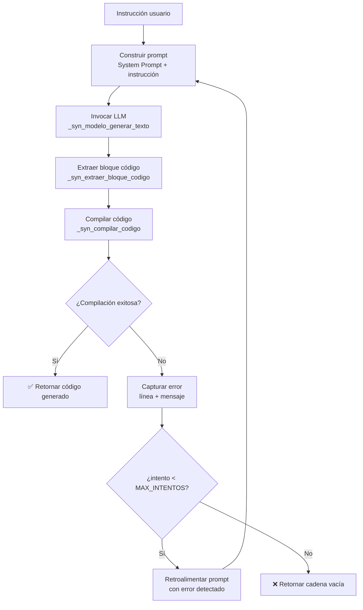

# Bucle del Oráculo

El **bucle del Oráculo** es el mecanismo de auto-corrección que permite a un LLM generar código Synapse funcional sin intervención humana.

## Vista general



## Implementación en Synapse (`oraculo.syn`)

### `generar_codigo(modelo, instruccion, max_intentos)`

```
1. prompt = SYSTEM_PROMPT + "Instrucción: " + instruccion
          + "Genera SOLO el código Synapse:"

2. PARA intento = 0,1,...,max_intentos-1:
   a. respuesta = generar_texto(modelo, prompt, 256, 0.7, 40, 0.9)
   b. código = extraer_bloque_codigo(respuesta)
   c. SI código vacío: código = respuesta
   d. resultado = compilar_codigo(código)
   e. SI resultado == 0: retornar código
   f. prompt += "Error: " + obtener_error() + " Corrige:"
   g. siguiente intento

3. retornar ""
```

### System Prompt

El `SYSTEM_PROMPT` define 15 reglas sintácticas y semánticas del lenguaje Synapse que el modelo debe respetar:

- Indentación: múltiplos de 4 espacios (no tabs)
- No se usan llaves `{}` para bloques
- `#lang: es` al inicio
- Bloques por indentación
- `funcion nombre(param: tipo) -> tipo:` para funciones
- `si condicion:` para condicionales
- `mientras condicion:` para bucles
- `retornar expr` para valores de retorno
- Tipos: `entero`, `decimal`, `texto`, `booleano`, `puntero`, `tensor`, `nulo`
- Strings entre comillas dobles
- Sin punto y coma al final de línea
- `verdadero` / `falso` para booleanos
- `nulo` para puntero nulo

## Compilación interna (`_syn_compilar_codigo`)

```c
int _syn_compilar_codigo(CadenaSegura fuente) {
    // 1. Escribir fuente a oraculo_temp.syn
    // 2. Ejecutar helper vía _popen:
    //      py -3 _compilar_helper.py oraculo_temp.syn
    // 3. Leer JSON de stdout
    // 4. Parsear resultado
    // 5. Cachear código C o errores
    // 6. Limpiar archivo temporal
    // 7. Retornar 0 (éxito) o 1 (error)
}
```

El helper `_compilar_helper.py` ejecuta el pipeline completo de Synapse (Lexer → Parser → AnalizadorSemántico → GeneradorC) y devuelve JSON estructurado:

**Éxito:**
```json
{"exito": true, "codigo_c": "#include <stdio.h>\n..."}
```

**Error:**
```json
{"exito": false, "errores": [
    {"linea": 5, "columna": 8, "mensaje": "Variable no declarada"}
]}
```

## Extracción de bloques de código

```c
CadenaSegura _syn_extraer_bloque_codigo(CadenaSegura texto) {
    // Busca marcadores ```...``` en el texto
    // Si encuentra uno, extrae el contenido interior
    // Si no encuentra, retorna cadena vacía
    // (el llamador usa texto completo como fallback)
}
```

## Telemetría

El bucle imprime logs en consola para seguimiento:

```
[Oráculo] Generando código... (Intento 1/3)
[Compilador] Error detectado: Re-inyectando contexto...
[Oráculo] Generando código... (Intento 2/3)
[Compilador] Éxito. Binario generado.
```
